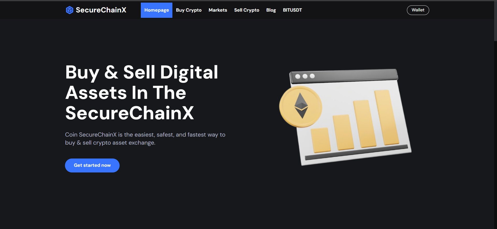
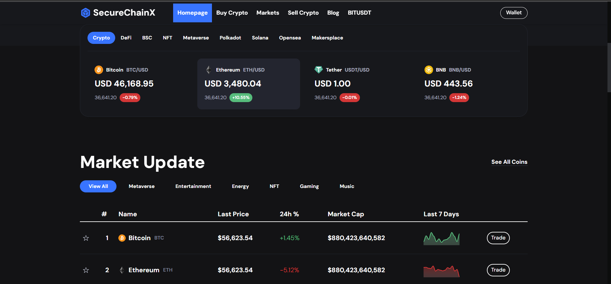
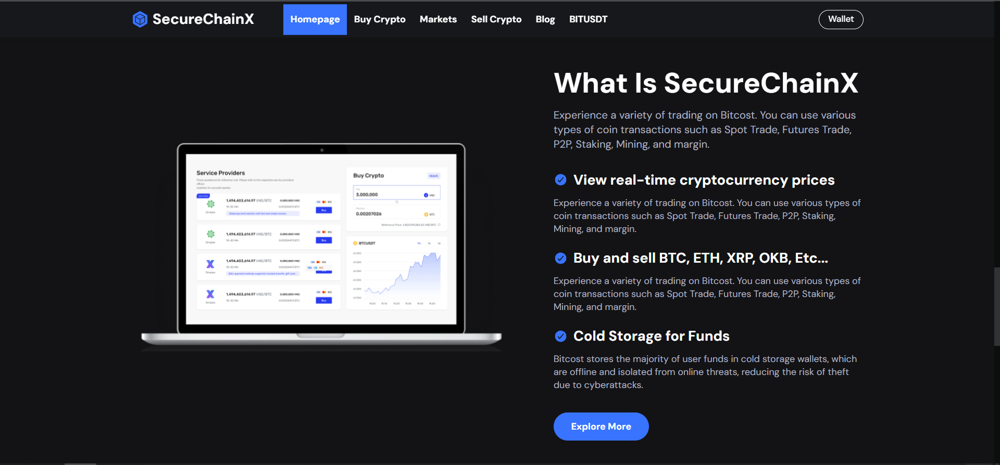

<h1 align="center">
  
  <div>
    <h5>SecureChainX: Your trusted cryptography wallet website for secure and seamless cryptocurrency management.</h5>
  </div>
</h1>

Our solution SecureChainX:SecureChainX is a cutting-edge cryptography platform offering a secure digital wallet for managing cryptocurrencies with ease. Our platform ensures top-notch security against intruders while providing a user-friendly interface for seamless wallet usage. Experience fast and secure transactions, real-time market data, and a scalable platform for buying and selling digital assets effortlessly.

## Team Members

<div>
  <p>Team Number: <b>VH235</b></p>
  <p>Team Name: <b>Quantum Questers</b></p>
</div>

| Name | Email | GitHub Profile |
| :----: | :----: | :----: |
| S Kiran Kumar| kiransrinivasan03@gmail.com |  [S Kiran Kumar](https://github.com/S-kiran-k) |
| U Hari Prashanth| hariuk12345@gmail.com |  [hari-prashanth](https://github.com/hari-prashanth) |
| Shoban Pradish | felixpradish1@gmail.com | [Shobanpradish](https://github.com/Shobanpradish) |
| Steve Hamilton | stevehamilton339@gmail.com | []() |

Thanks to all Team members, for their dedication towards building the project!

**Check out The Prototype Website:**<a href="https://quantum-questers-secure-chain-x.vercel.app/">Quantum-Questers-SecureChainX</a>

**Check out The Video:**https://drive.google.com/file/d/1z7MiFtlR6qjndiri6B34X6zYnYh9cWPi/view?usp=sharing

## Problem Statement
In the cryptocurrency landscape, **users struggle** to find a platform that balances security, usability, and scalability. Existing solutions often compromise on one or more of these aspects, leading to vulnerabilities or usability issues. SecureChainX aims to fill this gap by providing a **secure, user-friendly, and scalable** platform for managing digital assets **effectively and securely**.

we have categorized the above statement following aspects
1.**Security Focus:** SecureChainX prioritizes robust security measures, implementing advanced encryption techniques and authentication protocols to safeguard user data and assets from unauthorized access and cyber threats.

2.**User-Centric Design:** The platform emphasizes a user-friendly interface and intuitive user experience, ensuring that users can easily navigate the platform, manage their wallets, and execute transactions without complexity or confusion.

3.**Scalability and Performance:** SecureChainX is built on a scalable architecture, capable of handling increased user demand, growing transaction volumes, and evolving market dynamics without compromising on performance or security, providing a seamless experience even during peak usage periods. 

## Project Usecases

1.**Secure Wallet Management:** Users can securely store, send, and receive various cryptocurrencies using SecureChainX's digital wallet feature. The platform employs advanced encryption techniques to protect private keys and ensure the security of digital assets.

2.**Efficient Crypto Trading:** SecureChainX facilitates seamless buying and selling of digital assets, providing users with access to real-time market data, diverse trading pairs, and fast transaction processing. Traders can execute orders quickly and efficiently while staying informed about market trends.

3.**Secure and Private Messaging:** In addition to managing digital assets, SecureChainX offers a secure messaging feature that leverages encryption to ensure private and tamper-proof communication between users. This feature is especially useful for discussing sensitive financial information securely.

## Project Images

## Project Images

| 1) Page-1 |  
| :---: |
|  | 

| 2) Page-2 |  
| :---: |
|  | 

| 3) Page-3|  
| :---: |
|  | 

## To check out the website
Clone the github repo and open root directory
```bash
git clone "https://github.com/S-kiran-k/Quantum-Questers_SecureChainX.git"
cd Quantum-Questers_SecureChainX
```


