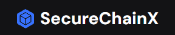

<h1 align="center">
  
  

    <h5>SecureChainX: Your trusted cryptography wallet website for secure and seamless cryptocurrency management.</h5>
  

</h1>

Our solution SecureChainX:SecureChainX is a cutting-edge cryptography platform offering a secure digital wallet for managing cryptocurrencies with ease. Our platform ensures top-notch security against intruders while providing a user-friendly interface for seamless wallet usage. Experience fast and secure transactions, real-time market data, and a scalable platform for buying and selling digital assets effortlessly.

## Team Members

  
Team Number: <b>VH235</b>

  
Team Name: <b>Quantum Questers</b>

| Name | Email | GitHub Profile |
| :----: | :----: | :----: |
| S Kiran Kumar| kiransrinivasan03@gmail.com |  [S Kiran Kumar](https://github.com/S-kiran-k) |
| U Hari Prashanth| hariuk12345@gmail.com |  [hari-prashanth](https://github.com/hari-prashanth) |
| Shoban Pradish | felixpradish1@gmail.com |  |
| Steve Hamilton | stevehamilton339@gmail.com |  |

Thanks to all Team members, for their dedication towards building the project!

